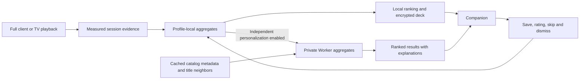

# Recommendations from watch habits: research and implementation proposal

Research date: 8 September 2026. This is an audit and proposal, not a deployed feature.
The [follow-up evaluation](recommendation-evaluation/README.md) adds reproducible tests of
the actual production functions, corrected interpretation of completion thresholds, and a
local performance benchmark. Use that assessment before implementing this proposal.
Inspected the full client and Worker at working-tree base `a90f4601`, and the separate
Companion repository at base `b4846d9`. Other work was changing unrelated files during
the audit; this document describes the recommendation and progress paths inspected.
Worker package version at inspection: `1.11.0`. No personal viewing database, live account,
deployed Worker, or physical TV was inspected or changed.

**Recommendation: improve the existing content-based engine with reliable viewing evidence
and title-to-title candidate retrieval. Use the same taste rules for Discover, the existing
personalized row, and Companion. Add optional ranking in the user's private Worker for
Companion users who need fresh personalization while the main client is unavailable.**

The largest immediate gains should come from correcting input semantics and widening the
candidate pool. This is an engineering hypothesis; relevance has not been measured. A private
household Worker does not provide the cross-user dataset needed to reproduce Netflix-style
collaborative filtering.

## What izumi currently knows and uses

| Path | Data and behavior verified in source | Recommendation limitation |
| --- | --- | --- |
| Full-client history | One record per media ID: last opened episode, watched-through progress, update timestamp, compact media metadata. Incognito has a separate memory-only overlay. | No session log, unique watched duration, or independently counted completed episodes. |
| Full-client resume | Per media/episode position and duration in seconds; timestamps and completion tombstones; at most 500 records. Watched threshold is position/duration >= 85%. | A seek changes position without proving consumption. Completed/old positions are cleared or pruned. Discover does not consume this store. |
| Local library | Lists, status, score, progress and tracking details. | Discover uses status, score and list membership, but not tracking progress or repeat count directly. |
| Discover | History, local library and save/dismiss decisions produce weighted features. Skip hides for seven days without negative affinity. | Every history entry is positive. Metadata supplied by history is sparse. |
| Personalized anime row | Up to eight local history seeds and ten linked-account seeds; follows catalog recommendation edges. | Separate scoring and dismissal rules; only the anime identity path; low ratings remain positive here. |
| Companion | Saves season/episode checkpoints, position, duration and completion locally; latest 24 records, up to 180 days old. | Designed for resume/recovery, not long-term viewing analytics. Replays overwrite the episode checkpoint. |
| Worker sync | Stores encrypted checkpoints, encrypted discovery decisions and encrypted snapshots. Checkpoint storage is bounded to 200 per pairing. | Cannot read the encrypted history to infer tastes or run personalized ranking. |
| Independent accounts | Worker can read connected account libraries and supported progress/history; playback export is separately enabled. | These account caches are not inputs to a Worker recommendation ranker in the inspected implementation. |

Evidence: [history](../src/lib/player/history.ts), [positions](../src/lib/player/progress.ts),
[Discover signals](../src/lib/recommendations/discovery-queue.ts),
[personalized row](../src/lib/components/cards/PersonalizedRow.svelte),
[row query](../src/lib/anilist/queries.ts), [Worker handlers](../cloudflare-sync-worker/src/index.js),
[account adapter](../cloudflare-sync-worker/src/accounts.js).
Companion evidence is in the sibling repository's `src/lib/playback-progress.ts`,
`src/lib/receiver.ts` and `src/lib/discovery.ts`.

### What the engine already does well

[The shared engine](../src/lib/shared/recommendation-engine.ts) is pure and deterministic
for an explicit timestamp. It supports negative affinity, verified external-ID deduplication,
explanations, time decay and genre/catalog variety. It uses genres, tags, contributors,
studios, language, country, decade and media kind when available. Public ratings make a
small contribution; its score is not a predicted percentage match.

Keep these properties. There is no reason to replace the engine wholesale before fixing
the signals reaching it.

### Confirmed problems with current signal interpretation

1. **Opening can resemble liking.** `historyTasteSeeds` uses the last opened episode in
   `max(progress, episode * 0.35)`. Unknown episode counts fall back to progress, then one.
   The following values were reproduced by executing the current function body with a
   metadata-only stub for `tasteSnapshot`, holding all timestamps at the same instant:

   | History record | Seed weight before shared-engine decay |
   | --- | ---: |
   | Opened episode 1 of 12; zero confirmed progress | 0.6602 |
   | Opened episode 12 of 12; zero confirmed progress | 0.7725 |
   | Opened episode 3; unknown episode count; zero confirmed progress | 1.0000 |
   | Watched through episode 3 of 12 | 0.7375 |
   | Watched through episode 3 of 100 | 0.6605 |
   | Finished 12 of 12 | 1.0000 |

   An unknown-length title can therefore receive maximum history weight from an opening.
   Several real episodes of a long show can receive almost the same weight as a one-off start.
   These are signal weights, not predicted relevance or final ranking scores.

2. **Progress is a watched-through marker.** Despite the history comment describing an
   episode count, `recordProgress` stores `max(previous, episode)`. Completing episode 10
   does not establish that ten distinct episodes were consumed. Manual progress changes and
   imports are additional evidence types, not observed viewing sessions.

3. **Explicit ratings can lose their meaning.** A completed title still in a list and rated
   20/100 receives `0.65 + 0.55 + (20 - 60)/45 = +0.3111`. A Discover save has priority 3,
   above a later library rating at priority 2. An old save can therefore override a subsequent
   poor rating. The separate personalized-row `accountSeed` clamps ratings to a positive
   minimum of 0.35. Signal provenance and latest explicit preference need stronger rules.

4. **Not all engine features survive storage.** `mediaSnapshot` retains genres and
   `seasonYear`, but omits tags, original language, creators, studios, country and `startDate`.
   `discoveryTasteItem` reads year from `startDate`, so even the retained year may not help.
   Enriching the currently visible Discover card updates presentation, not the candidate
   features used to rank the pool. Consequently actual history-driven matching can be much
   closer to genre matching than the engine's supported feature list suggests.

5. **Candidate retrieval is mostly generic.** `loadDiscoveryCandidates` fetches enabled
   catalogs using an empty query or their home lists, interleaving at most 100 items per
   provider per load. Taste affects ordering after retrieval. A highly relevant obscure film
   absent from those pages cannot be recommended. The anime row already demonstrates how
   title-to-title recommendation edges can expand retrieval.

6. **TV results are constrained differently.** `companionDiscovery` sorts signals by
   priority then recency and retains 100 before ranking. A sufficiently large library or
   decision history can crowd out all watch-history seeds. Its candidate cache lasts
   15 minutes; the first-page fetch has an eight-second timeout. It returns up to 60 ranked
   titles, potentially fewer after snapshot compaction. TV feedback filters immediately,
   but new personalized ordering requires a fresh main-client snapshot.

7. **Event identity and time need repair before aggregation.** `applyCompanionProgress`
   receives season and original `updatedAt`, but writes through `recordPlay`/`savePosition`
   using current time and `media.episode`, without incorporating season into that local
   position key. Late recovery refreshes apparent recency. Season-relative episode numbers
   also need an explicit mapping to the client's episode identity before counting or merging
   watches. These are code-path findings; the season case was not tested on a physical TV.

8. **Several policies currently diverge.** History has an internal recency term and then
   shared-engine decay; the older row has another formula. Discover excludes every history
   title even if merely opened, and feedback is separate from the older row's dismissal store.
   The same viewer can receive inconsistent behavior across screens.

Evidence: [signal building](../src/lib/recommendations/discovery-queue.ts),
[history writes](../src/lib/player/history.ts), [older row ranking](../src/lib/recommendations/for-you.ts),
[candidate retrieval](../src/lib/recommendations/candidates.ts),
[Discover page](../src/routes/app/discovery-queue/+page.svelte),
[Companion deck generation](../src/lib/companion/discovery.ts),
[checkpoint application](../src/lib/companion/client.ts),
[snapshot compaction](../src/lib/companion/snapshot.ts).

## Comparison with other clients and research

Only documented behavior is compared below. Public documentation does not establish exact
ranking weights or prove one product's recommendation quality exceeds another's.

| System | Documented behavior | Lesson for izumi |
| --- | --- | --- |
| Netflix | Uses viewing history, ratings, similar viewers, title metadata and time spent; recent activity has more influence. Optional initial title choices help new profiles. | Combine signals and offer a cold-start path. Cross-user learning requires a dataset izumi does not currently have. [Netflix explanation](https://help.netflix.com/en/node/100639) |
| YouTube | Describes watch time alongside likes/dislikes and satisfaction surveys. Its 2016 research separates candidate generation from ranking. | Measure successful choices and satisfaction, and improve retrieval as well as scoring. [Product explanation](https://blog.youtube/inside-youtube/on-youtubes-recommendation-system/), [research paper overview](https://research.google/pubs/deep-neural-networks-for-youtube-recommendations/) |
| Plex | Optional sync sends title identity, watched state or rating, and timestamps. This supports recommendations; incomplete playback position is explicitly excluded from this particular cloud-sync feature. It distinguishes watch state from watch history. | Keep resume, consumption history and preference separate. Imported watched state cannot reconstruct real viewing duration. [Plex documentation](https://support.plex.tv/articles/sync-watch-state-and-ratings/) |
| Stremio | Public library schema distinguishes time watched, offset, overall time watched, watch count, duration and watched state. | Preserve those distinctions when importing. Field existence does not establish how every client records it or how recommendations use it. [Public schema](https://github.com/Stremio/stremio-core/blob/master/src/types/library/library_item.rs) |
| Nuvio | Public API separates progress and watched history, identifies season/episode and timestamps, and documents progress/duration in milliseconds. Completion can create history at >=90% for durations >=60 seconds. | Useful bootstrap data, with provenance and unit normalization. Its checkpoint API is not evidence of measured attentive viewing. [Public API](https://nuvio.tv/docs/nuvio-public-api.md) |

The Nuvio document was retrieved directly over HTTPS after the browser research tool could
not read it. Our Worker currently preserves existing Stremio watch counters and bitfield
while updating resume fields; it does not increment measured watch time. Izumi/TV use an
85% watched-state threshold, while the account adapter uses 90% for the corresponding
completion behavior. Preserve external service semantics; do not treat every imported
completion flag as evidence of the same amount of viewing.

Two research findings inform the proposal:

- Implicit actions provide noisy evidence with varying confidence. Repeated viewing can
  increase confidence, while non-viewing is not reliable evidence of dislike.
  [Hu, Koren and Volinsky, 2008](https://yifanhu.net/PUB/cf.pdf).
- Optimizing raw watch time can favor longer videos independently of user interest.
  This motivates duration-aware evaluation and bounded title influence here; it does not
  validate any particular film/series weighting formula.
  [Zhan et al., 2022](https://arxiv.org/abs/2206.06003).

## Proposed viewing evidence

Introduce a profile-scoped consumption ledger separate from existing resume storage.
The following is a proposed schema, not an existing protocol:

| Record | Required information |
| --- | --- |
| Playback session | Schema version, profile, device, session ID, canonical title ID, episode/video identity including season, sequence number, event time and ingestion time |
| Consumption | Active wall-clock seconds, consumed media intervals, known duration, playback speed, last position, completion evidence |
| Context | User-selected versus autoplay start; terminal error/stop reason when known; provenance such as observed playback, manual mark, imported state, or legacy checkpoint |
| Title aggregate | Unique consumed duration/episodes, qualifying viewing days, bounded repeat evidence, last actual viewing time, confidence, latest explicit preference |
| Recommendation exposure | Deck/model version, candidate ID, position, actual visible exposure, selection and resulting session ID |

Record only normal forward playback consistent with elapsed monotonic time and playback
speed. Ignore pause, buffering, seeking, loading, trailers and implausible jumps. At 2x
speed, distinguish 30 seconds of elapsed viewing from 60 seconds of consumed media.
Union consumed intervals so scrubbing or replaying the same minute cannot imply a complete
film. Delayed heartbeats must not fill unobserved gaps with invented watching.

Write cumulative session checkpoints locally, then upload bounded batches when connected.
Use a unique session ID and monotonically increasing sequence number to make retries
idempotent. Merge intervals and completed-episode identities across devices rather than
summing duplicate checkpoints. A replay is a new session. Preserve original event time;
an import time is not a viewing time. Unknown duration stays unknown.

Start with a configurable short retention period for raw sessions, for example 90 days,
and retain compact title aggregates for longer. This duration is a proposed engineering
default. Delete/reset must remove derived aggregates and invalidate decks, with tombstones
or a profile generation counter preventing old devices from restoring deleted evidence.
Keep all incognito activity out of durable evidence, exports and recommendation updates.
Provide an explicit personalization-history control; existing resume preferences should
not silently become permission to export more viewing detail.

External players without reliable playback callbacks and imported watched lists remain
usable low-confidence inputs. Never manufacture historical watch minutes by multiplying
the furthest episode number by runtime.

## Proposed taste and ranking rules

Build one normalized title-level signal set for all recommendation surfaces. Preserve the
existing engine initially, with richer inputs and corrected precedence.

| Observation | Initial treatment to evaluate |
| --- | --- |
| Opened a title; playback failed; short unconfirmed start | Neutral taste. Preserve resume/navigation behavior separately. |
| Meaningful measured partial viewing | Weak positive evidence, increasing smoothly with unique coverage |
| Finished film or several distinct episodes across visits | Stronger confidence, capped per title |
| Continued on another day or intentionally rewatched | Additional bounded confidence; autoplay alone is weaker |
| Latest explicit positive/negative rating or Not for me | Direct preference; a negative rating overrides earlier saves and incidental completion |
| Watchlist/save | Modest interest, below post-viewing ratings; list membership alone is not satisfaction |
| Skip, pause, missing history, playback error | No negative genre affinity; skip retains its current temporary hide behavior |
| Explicitly dropped title | Negative title evidence; weaker generalization to broad genres than a direct dislike |

For an initial trial, a qualifying start could require at least
`min(300 seconds, 20% of runtime)` of unique observed consumption. Use a positive minimum
for very short content and a conservative time threshold when runtime is unknown. These
are tunable hypotheses, not industry standards or permission to reinterpret legacy positions.

Use distinct episode evidence with diminishing returns for series, such as a capped
`log1p(completedEpisodes)` contribution plus returns on separate days. Do not require a
viewer to finish a 100-episode show before expressing interest, or allow that show to
dominate their entire profile. Maintain film and series taste components with a shared
component for genuine cross-format interests. Apply recency once to observed events;
explicit dislikes should remain effective until changed.

Retrieve candidates from several complementary pools:

1. Title-to-title neighbors of a bounded, diverse set of strong positive seeds. Reuse the
   existing anime recommendation edges and add the documented movie/TV recommendation
   APIs through the existing metadata adapter. These APIs supply candidates, not a
   personalized score for this izumi viewer. [Movie recommendations](https://developer.themoviedb.org/reference/movie-recommendations),
   [TV recommendations](https://developer.themoviedb.org/reference/tv-series-recommendations).
2. Metadata discovery from supported genres, keywords, creators, language and era.
   [Documented movie filters](https://developer.themoviedb.org/reference/discover-movie).
3. Enabled catalogs and curated lists, plus a modest exploration allocation. Start testing
   around 10–20% exploration; do not describe this as a validated optimum.

Cache compact, spoiler-safe ranking metadata for seeds and candidates before scoring.
Separate this cache from resume snapshots. Batch enrichment and cap requests so showing a
deck does not trigger hundreds of detail calls. Keep verified cross-catalog IDs, typed
movie/show identities, and explicit franchise/season relationships; never merge on title alone.

Rank by taste affinity and title-neighbor support, then diversify by topic/franchise and
format with a small quality contribution. Existing catalog diversity remains useful, but
catalog membership should not be the primary proxy for varied content. Apply profile
restrictions, explicit dislikes and verified watched-title exclusions before display.
Keep Continue Watching distinct from discovery, and make rewatch suggestions intentional.
Catalog membership does not guarantee playable availability; do not claim it does.

Explain the actual evidence: “Because you finished…”, “Similar to titles you rated highly”,
or “Something different”. Show “finished” only with that evidence. Do not invent a match
percentage. For new profiles, offer a few optional favorite titles and genres, or start with
diverse catalog picks clearly labeled as such.

## Worker and Companion architecture

| Mode | Where ranking runs | What the Worker can read | Main client offline |
| --- | --- | --- | --- |
| Existing private mode, improved | Full client | Encrypted sync envelopes and routing metadata; separately configured catalog/account operation retains its existing disclosure | TV uses the last personalized deck and locally filters decisions |
| Proposed independent personalization | User's private Worker | Separately opted-in title-level consumption summaries, explicit feedback and metadata needed for ranking | TV can fetch a fresh personalized deck |
| Deferred shared learning service | Separate training/service infrastructure | Depends on a future, deliberately chosen sharing model | Possible, but requires data and operational justification |

**Implement the first mode as the foundation and the second as an optional extension for
Companion-only use.** The existing encrypted checkpoint or snapshot cannot simply be
queried in D1 for genres and watch time. Independent catalog/account access also does not
grant permission to decrypt ordinary device sync or reuse account history for a new purpose.
Aggregate taste features themselves reveal preferences; describe their readability plainly.

Proposed independent mode:



The diagram distinguishes two modes; implementing it must not upload the same session
through both paths and count it twice. The normal encrypted transport stays encrypted.

Suggested Worker modules are a consumption validator/aggregator, a metadata candidate cache
and a recommendation handler. Reuse the pure engine in the AGPL Worker build; preserve
the existing boundary that the separately licensed TV consumes data rather than bundling
that engine. Exact new route/table names should be finalized during implementation.

For D1, use indexed rows keyed by owner, profile and canonical title; store idempotent
session receipts separately from compact aggregates and explicit decisions. Cache candidate
metadata separately. Return deck version, generation time, input revision, algorithm version
and explanations. Invalidate on meaningful consumption, explicit feedback, profile or
catalog changes. Feedback can filter immediately while a refreshed deck is prepared.
Empty-history or failed-provider paths must return honest fallback results.

Bound work before moving ranking to Workers. The current implementation evaluates many
candidate/seed pairs and repeatedly scores diversity, so portability alone is not a CPU
benchmark. Start with a few hundred candidates and a representative seed budget, reserving
capacity for viewing evidence as well as explicit choices. Avoid the current all-priority
100-seed truncation. Recompute after material changes, not each playback heartbeat.

Cloudflare currently documents 10 ms CPU per free HTTP invocation, 128 MB memory and
50 subrequests; D1 has a 2 MB maximum row size and 50 queries per free invocation. Cache,
batch, index and benchmark on the intended tier; do not promise free-tier feasibility based
on a Node timing. [Workers limits](https://developers.cloudflare.com/workers/platform/limits/),
[D1 limits](https://developers.cloudflare.com/d1/platform/limits/).

No vector database, LLM or training cluster is required for this first implementation.
Gorse supports training from users, items and interactions and multiple retrieval methods,
but adding it would be a separate service/data decision. It would not repair missing watch
evidence or manufacture a useful collaborative dataset inside one household.
[Gorse project](https://gorse.io/).

### Account bootstrap and deployments

Use existing account adapters to normalize supported history/ratings into provenance-tagged
seeds when the feature is enabled. Do not assume all connected trackers are already part of
Discover: its current inputs are local library, durable history and Discover choices.
The separate anime row queries its linked account directly. The independent Worker account
cache is another distinct input that needs an explicit adapter.

Respect current import limits: the inspected account path fetches at most 200 recent progress
entries and the first 500 watched-history entries for the relevant account service. A larger
personalization backfill needs deliberate pagination, deduplication and resumability; do
not call those caches a complete lifetime history. Imported records should improve initial
coverage without being mistaken for newly measured viewing.

Ship protocol changes in both authoritative repositories, independently. In this repository,
update Worker migrations, capability/version negotiation, native deployment inclusion and
the generated Worker bundle. In Companion, update event capture, transport and result
consumption. Older clients/Workers retain the cached-deck behavior. The Companion installer
also ships a reviewed Cloudflare deployment snapshot under `installer/cloudflare-source/`;
its README identifies the TV Link source revision workflow. Verify its actual Worker payload
and migration source before release. Editing this repository's Worker alone does not prove
that every installation path will deploy the new version.

## Implementation order and acceptance criteria

| Stage | Concrete work | Acceptance evidence |
| --- | --- | --- |
| 1. Correct existing signals | Remove episode-open pseudo-completion; treat unknown duration/count conservatively; make latest explicit ratings authoritative; preserve actual event time and episode identity | Synthetic cases above no longer treat opens as completed watches; low ratings stay negative; season 1 episode 1 and season 2 episode 1 remain distinct |
| 2. Collect dependable consumption | Add session ledger and title aggregates on full client and TV; add sync/versioning and reset semantics | Seeking, buffering, pauses, retries, overlapping intervals and cross-device replay do not inflate coverage; incognito never persists |
| 3. Unify recommendations | One preference builder and feedback model across surfaces; metadata cache; title-neighbor retrieval; stable typed IDs and diversified candidates | Same normalized profile/input revision yields consistent ranking; a relevant candidate outside the generic home pages can be retrieved |
| 4. Support independent Companion ranking | Separate opt-in summaries, Worker ranking/cache, result versions, migrations and installer distribution | TV earns and uses new taste evidence with the main client closed; profile isolation, deletion, disablement and old-version fallback pass |
| 5. Evaluate and tune | Exposure/outcome ledger, offline replay and a controlled pilot | Relevance gains are measured against the corrected baseline, with uncertainty and regressions reported |

Before implementing a learned model, evaluate whether stages 1–4 solve the practical problem.
An embedding similarity experiment may later help tone/theme matching, but it should earn
its complexity by improving measured retrieval/relevance over the metadata baseline.

## How to establish that recommendations are successful

The current latest-state history and last-decision stores cannot support trustworthy
historical recommendation evaluation. They lack the original candidate pool, impressions,
multiple viewing events and outcome attribution. Collect the proposed evidence prospectively;
synthetic tests validate semantics, not personal relevance.

For offline evaluation, freeze each profile at time T and predict future newly consumed
titles. Use only metadata, eligibility, exposures and feedback available at T; hold later
events out. Measure candidate recall separately from ranking NDCG@10/Recall@20. Also
report catalog coverage, franchise diversity and repeat exposure. Split by films/series,
new/established profiles, metadata coverage and TV/main-client viewing. An unobserved
title is not a confirmed negative; interpret replay results with exposure bias in mind.

For a pilot, compare the corrected existing engine with the new retrieval/ranking version.
Prefer randomization by profile with stable assignment. For a single household, use a
clearly labeled exploratory crossover and avoid claims of statistical certainty.

Primary outcome: **a visible recommendation leads to a meaningful watch that the user
values**. Operational proxies should include:

- Qualifying recommendation-start rate per exposed profile/session, using actual observed
  coverage rather than clicks. Predefine the attribution window, for example seven days,
  and connect selections to canonical titles and playback sessions across devices.
- Film completion and return to another episode on a later day, reported separately.
- Explicit positive/negative feedback after viewing, with save rate as a secondary signal.
- Time from browsing to a successful choice, dismiss rate and repeated unwanted exposure.
- Guardrails: playback failures, profile leakage, missing metadata, candidate availability,
  latency, Worker CPU and writes, and dependence on autoplay for apparent gains.

Predefine the minimum useful improvement and sample size from observed baseline rates.
Do not choose a target after seeing results or claim that passing unit tests proves better
recommendations. Low traffic may only support qualitative profile reviews initially.

## Verification performed

The following focused suites passed on 8 September 2026:

- Full client: seven suites, **28 tests** covering shared ranking, Discover, the older row,
  candidate loading, feedback sync and Worker companion/discovery contracts.
- Authoritative Companion source: two suites, **14 tests** covering playback checkpoints
  and discovery decks. The first broad matcher also selected copied fixtures; the reported
  count here is the rerun with the repository's normal exclusions.
- Executed the current `historyTasteSeeds` function body for the six synthetic examples;
  independently evaluated the library rating arithmetic shown above.

Commands, run in their respective repository roots:

```powershell
# Full client
.\node_modules\.bin\vitest.cmd run src/lib/shared/recommendation-engine.test.ts src/lib/recommendations/discovery-queue.test.ts src/lib/recommendations/for-you.test.ts src/lib/recommendations/candidates.test.ts src/lib/recommendations/feedback-sync.test.ts src/lib/sync/cloudflare-companion-sync.test.ts src/lib/sync/cloudflare-discovery-worker.test.ts --maxWorkers 2

# Companion
.\node_modules\.bin\vitest.cmd run src/lib/playback-progress.test.ts src/lib/discovery.test.ts --exclude 'izucomp/**' --exclude 'installer/**' --exclude 'updater/**' --exclude 'mobile/**' --exclude '.codex-tmp/**' --maxWorkers 2
```

The tests use existing local fixtures; no live account mutation, deployment, full release
build or measured recommendation-quality experiment was performed. Research deliverables
are this document and a link from the existing recommendation overview.
The report also has an explicit `.gitignore` exception so it remains trackable with that link.
